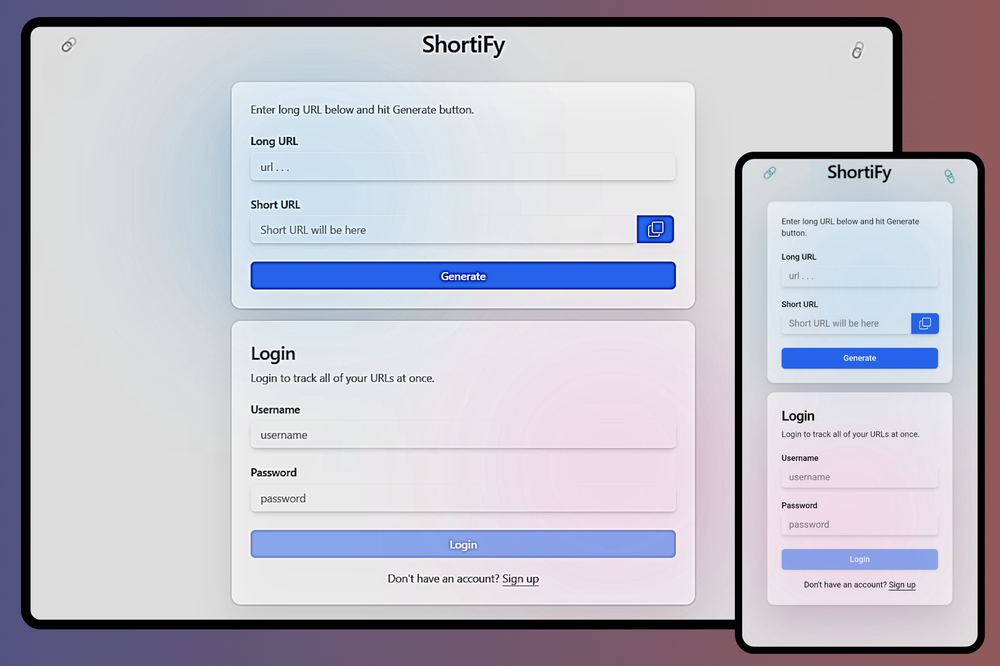

# 🔗 URL Shortener 🔗

A full-stack URL shortener built using the **PERN stack** (PostgreSQL, Express.js, React, Node.js). This application allows users to shorten URLs, track clicks, and manage their links efficiently.

##  Features

* Instantly shorten long URLs  
* User authentication (sign up, login, logout)  
* Track click statistics for shortened URLs  
* Guest users can shorten URLs without an account  
* Logged-in users can manage and view their shortened URLs

##  Tech Stack

**Frontend:** React, Tailwind CSS  
**Backend:** Node.js, Express.js  
**Database:** PostgreSQL  
**Authentication:** bcrypt for password hashing  
 

##  Access Modes

- Register or log in to manage your URLs.
- As a guest, you can still shorten URLs but without tracking features.

 

For any inquiries, reach out at prashantrathore1435@gmail.com .

